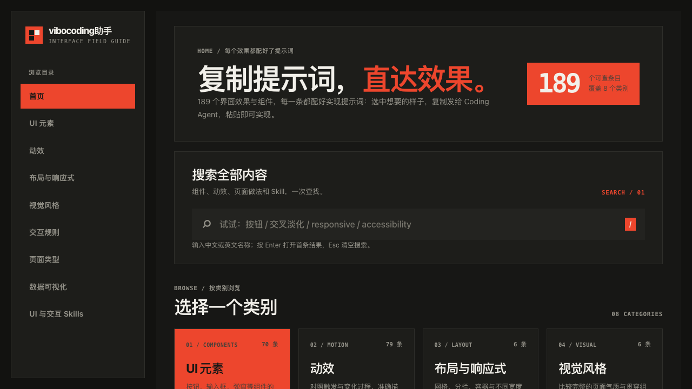
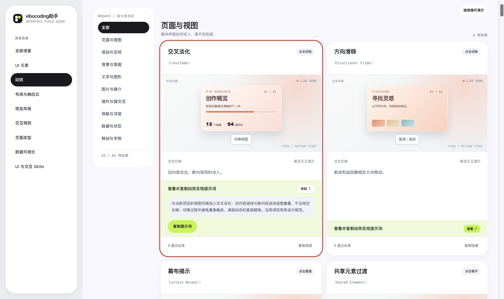
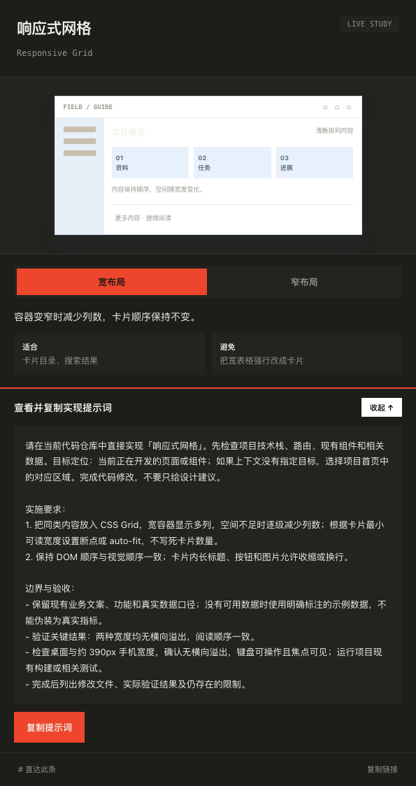
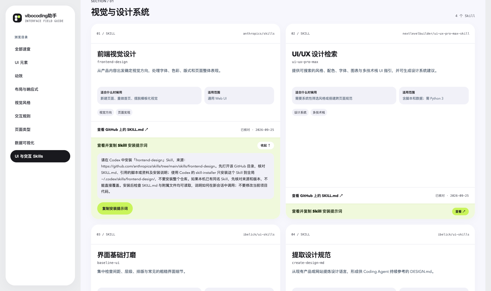

# vibocoding助手

面向 Vibe Coding 初学者的界面速查网站。收录 UI 元素、动效、布局与响应式、视觉风格、交互规则、页面类型、数据可视化及 UI 与交互 Skills 八类，共 152 个可查条目。

**在线访问：**[打开 vibocoding助手](https://zhang-netizen-1.github.io/vibocoding-assistant/)

**核心用法：找到想要的界面效果，查看示例，展开条目中的「查看并复制实现提示词」，点击「复制提示词」，直接粘贴给正在处理你项目的 coding agent。** 提示词描述了实现目标、交互与验收要点；需要时再补充你的业务内容。Skills 类提供的是可复制的 **Codex 安装提示词**，用途与界面实现提示词不同。

## 网站截图

**全部速查：**跨类别搜索名称，或从目录进入对应分类。



**动效条目：**先操作真实演示，确认效果，再展开提示词并一键复制。例如「交叉淡化」条目会说明切换时旧内容与新内容如何衔接。



**布局等速查条目：**提示词包含适用目标、实施要求和检查方式，可直接交给 coding agent 在当前项目中实现。



**UI 与交互 Skills：**查看 GitHub 来源，并复制对应的 Codex 安装提示词。



## 如何使用

1. 在首页搜索或进入分类，找到需要的 UI 元素、动效或设计方案。
2. 阅读说明并操作示例，确认它符合预期。
3. 展开「查看并复制…提示词」，点击「复制提示词」；将内容粘贴到 coding agent 对话中。条目还提供直达链接，方便分享给协作者。
4. 若要安装 UI 与交互 Skill，进入 Skills 分类，核对来源后复制「安装提示词」发给 Codex。

例如，UI 元素中的「按钮」条目提供这样的实现提示词：

> 实现可复用的按钮（Button）组件：支持主要、次要、危险三种用途样式，以及悬停、聚焦、禁用、加载状态；按钮文字与点击行为可配置，禁用或加载中不可重复触发。沿用项目现有设计规范。

`/flows/` 是补充阅读页，展示搜索与筛选、注册表单、文件选择与预览三组组合流程；它不计入八类条目总数。

## 本地构建与预览

需要 Python 3。网站本身不依赖后端或第三方前端包。

```bash
python3 scripts/build_site.py
python3 -m http.server 4173 --directory dist
```

在浏览器打开 `http://localhost:4173/`。构建结果位于 `dist/`，可以交给静态网站托管服务。发布时以 `dist/` 为根目录，不要把整个工作区作为网站根目录。

`main` 分支更新后，GitHub Actions 会运行检查、构建 `dist/` 并自动发布到 GitHub Pages。

## 内容维护

- UI 元素：编辑 `网页UI元素速查.html`。
- 动效：编辑 `动效速查-src/motion_entries.json` 和 `动效速查-src/motion_template.html`；新增演示分别在 `动效速查-src/extra_demos.py`、`动效速查-src/motion_extra.css`、`动效速查-src/motion_extra.js`。构建脚本会先重新生成 `动效速查.html`。
- 全部速查与共用导航：编辑 `site-src/index.html`、`site-src/home.css`、`site-src/home.js` 和 `site-src/site.css`。跨类别索引由 `site-src/search_index.py` 从条目源生成；全站视觉变量和覆盖规则集中在 `site-src/theme.css`，修改前先对照 `docs/design-system.md`。
- 其他五类速查：在 `site-src/guide_pages.py` 中维护内容和 HTML，在 `site-src/guides.css`、`site-src/guides.js` 中维护共用视觉和示例交互；视觉风格的六套风格样式在 `site-src/visual-styles.css`。
- UI 与交互 Skills：在 `site-src/skill_catalog.py` 中维护条目和安装提示词，在 `site-src/skills.css`、`site-src/skills.js` 中维护页面样式与交互。
- 组合流程：在 `site-src/flow_pages.py` 中维护案例和提示词，在 `site-src/flows.css`、`site-src/flows.js` 中维护页面样式、复制和本地表单演示。
- 站点输出：`scripts/build_site.py` 使用明确的文件清单构建首页、七类速查页、Skills 页、组合流程页、两个跨页转场演示页及共用资源；同目录中的其他文件不会进入 `dist/`。

运行构建检查：

```bash
python3 -m unittest discover -s tests -p 'test_site_build.py'
```

每个条目保留稳定的 HTML 锚点。例如 `/ui/#c-button`、`/motion/#e-view-crossfade` 和 `/layout/#g-layout-grid`。站点在卡片下方提供直达与复制链接操作。
